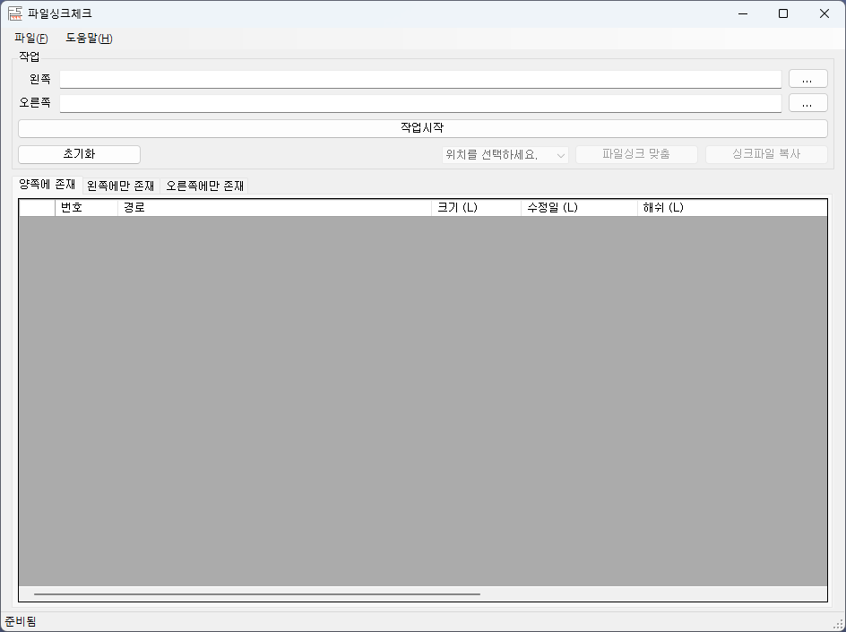

# Codename.FileSyncChecker

오래전 코찔찔이때 2개의 각 폴더 내 파일 비교를 위해서 제작된 프로그램

동작 잘 됨

단 아래의 소소한(?) 이슈가 있음

- .NET Framework 2.0때 제작된거 4.8.1로 버젼 변경
- 파일 비교는 하지만 Line 비교는 아니고 Hash 비교임
- 파일 비교 해쉬는 MD5임
- 텍스트 파일 및 이미지 파일들 즉 작은 용량에 많은 파일을 비교할려고 한 것으로 

    대용량 파일은 비교는 권장하지 않음
    - 비교는 되겠지만 느림
- 참조 어셈블리 Codename.MilkyWay는 소스코드 없음 🤦‍♂️
    - 코드 볼려면 역어셈블 해야 함 😓

